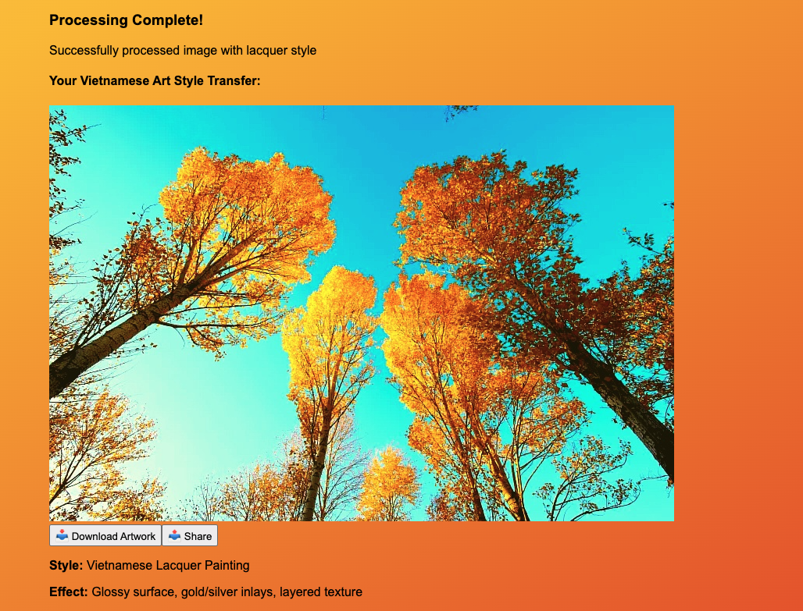
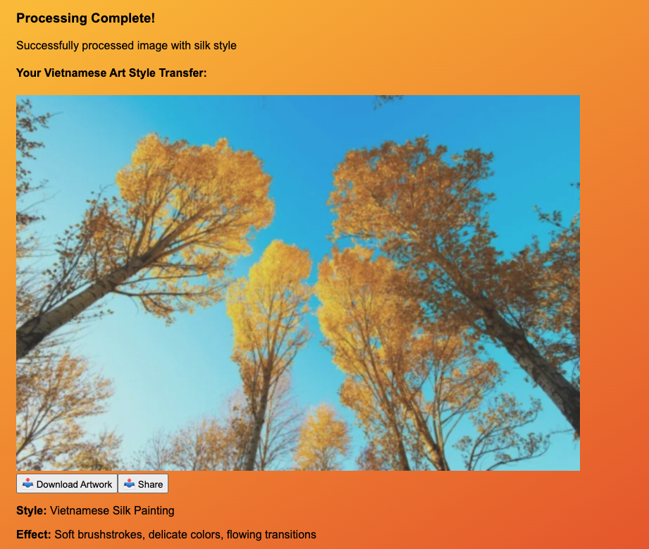
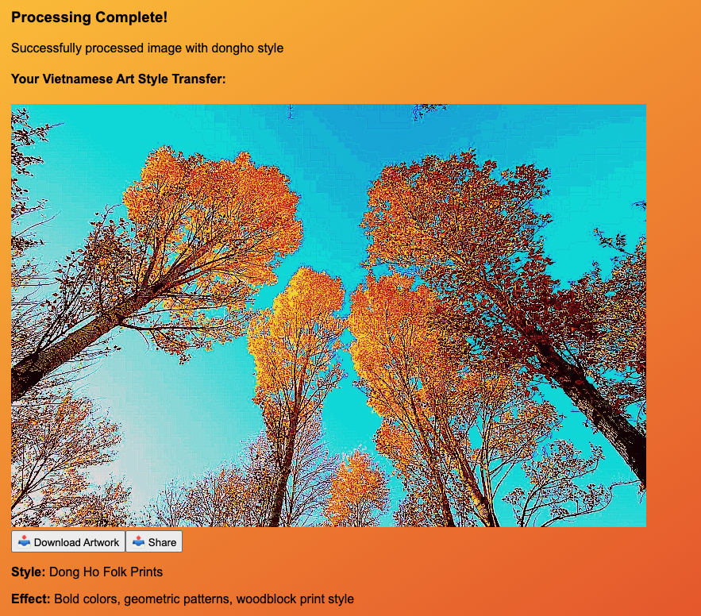

# Vietnamese Art Style Transfer

A full-stack web application that transforms modern photos into traditional Vietnamese art styles by filtering the pictures, combining computer vision with cultural heritage preservation.

## Demo Links
- **Frontend:** https://vietnamese-art-style-transfer.vercel.app
- **Backend API:** https://vietnamese-art-style-transfer.onrender.com

## Features

- **AI-Powered Smart Cropping**: Automatic face detection and composition analysis using OpenCV (Smart-Cropping is disabled due to M1 Mac dependencies, but locally worked)
- **Three Traditional Art Styles**: Lacquer painting, silk painting, and Dong Ho folk prints
- **Real-time Processing**: Fast image transformation with instant preview
- **Download & Share**: Save high-quality styled images
- **Cultural Heritage**: Preserving Vietnamese artistic traditions through technology

## Art Styles

### Lacquer Painting (Sơn Mài)
Traditional Vietnamese lacquer art dating back over 1000 years. Features glossy surfaces with gold/silver inlays.

### Silk Painting (Tranh Lụa)
Developed during the French colonial period. Soft, watercolor-like effects capturing Vietnamese landscapes.

### Dong Ho Folk Prints (Tranh Dân Gian Đông Hồ)
UNESCO-recognized heritage from the 16th century. Bold, colorful woodblock prints celebrating Tết.

## Technology Stack

**Frontend:** React 18, Vite, Tailwind CSS, Axios  
**Backend:** FastAPI, OpenCV, PIL, Uvicorn 
**AI/CV:** OpenCV Haar Cascades for face detection (local only)

## Quick Start
```bash
# Clone
git clone https://github.com/duongngothuy/vietnamese-art-style-transfer.git
cd vietnamese-art-style-transfer

# Frontend
cd frontend && npm install && npm run dev

# Backend (new terminal)
cd backend && python -m venv venv && source venv/bin/activate
pip install -r requirements.txt && cd app && python main.py
```

Visit `http://localhost:5173`

## Usage

1. Upload image (PNG/JPG, max 5MB)
2. Select art style (Lacquer, Silk, or Dong Ho)
3. Click "Apply Art Style"
4. Download your Vietnamese-style artwork

## Demo Screenshots for three styles on one image:





